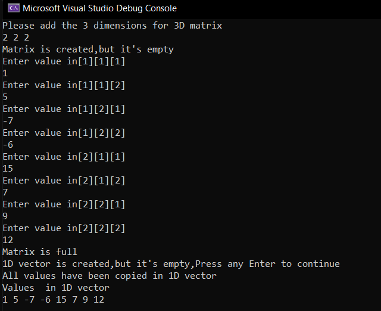

# Task-03(Matrix Flatten)

Master Micro's task to test programming skills for summer internship applicants
## Built Using 
- **C++**
## Problem Description 
A 3D matrix is to be stored in a 1D vector (flattened).
The 3D matrix is of size n x m x p and is indexed by i, j, k.
The 1D vector is of size q and is indexed by y.
## Requirements
1. Create a 1D vector suitable for storing the 3D matrix.
</a>
 
2. Convert the 3D matrix index (i, j, k) to a suitable 1D vector index (y).The complexity of the indexing from (i, j, k) to (y) is O(1).
 
 
</a>

   <h2 align='center'>Exmaple Test</h2>
   </a>
      <h2 align='center'>Errors</h2>
   </a>

